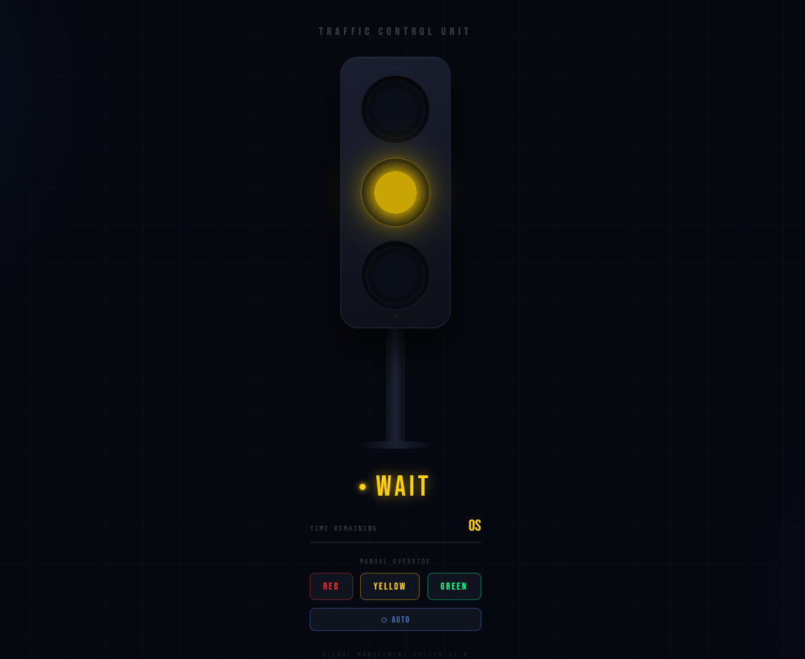

# 🚦 Traffic Light Simulation

A visually engaging, cyberpunk-styled traffic light simulation built with pure HTML, CSS, and JavaScript — no frameworks, no dependencies.

## ✨ Features

- **Realistic light animations** — glowing red, yellow, and green lights with multi-layered CSS box shadows
- **Auto cycle mode** — lights automatically cycle Red (20s) → Green (10s) → Yellow (5s)
- **Manual override buttons** — instantly switch to any light for demos
- **Live countdown timer** — color-coded timer synced to the active light
- **Progress bar** — visual indicator of time remaining per light
- **Pulsing yellow light** — animated blink effect for the WAIT state
- **Cyberpunk night-city UI** — animated grid background, ambient glow blobs, LCD-style display

## 🛠️ Tech Stack

- **HTML5**
- **CSS3** — Flexbox, CSS Variables, keyframe animations, box-shadow glow effects
- **Vanilla JavaScript** — DOM manipulation, setInterval, setTimeout

## 🚀 Live Demo

👉 [https://mayankpatel972.github.io/Traffic-light-Simulation/](https://mayankpatel972.github.io/Traffic-light-Simulation/)

## 📁 Project Structure

```
Traffic-light-Simulation/
└── index.html       # All HTML, CSS, and JS in one file
```

## 🖥️ How to Run Locally

1. Clone the repository:
   ```bash
   git clone https://github.com/MayankPatel972/Traffic-light-Simulation.git
   ```
2. Open `index.html` in any browser — no build step needed.

## 🎮 Controls

| Button | Action |
|--------|--------|
| **RED** | Manually activate red light (STOP) |
| **YELLOW** | Manually activate yellow light (WAIT) |
| **GREEN** | Manually activate green light (GO) |
| **⟳ AUTO** | Toggle automatic cycling on/off |

## 📸 Preview



## 👤 Author

**Mayank Patel**  
[GitHub](https://github.com/MayankPatel972)
